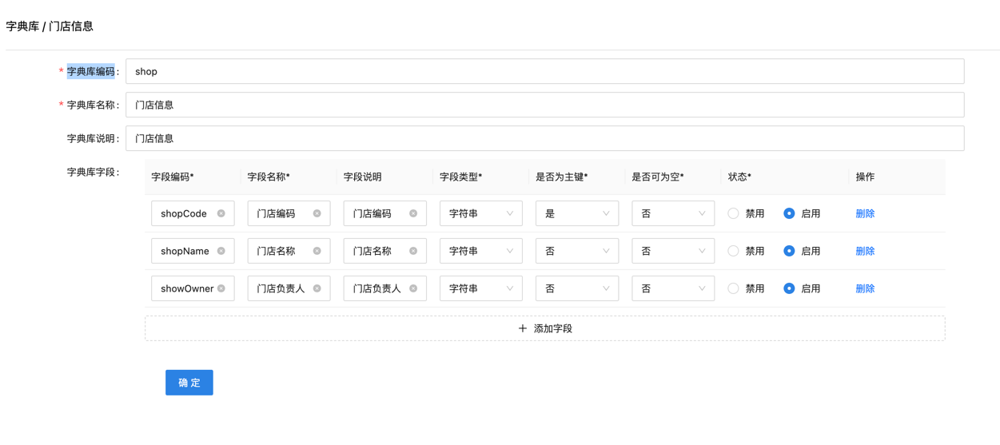

~~[上一页](quickstart.md)~~
[回目录](../README.md)
[下一页](flow.md)

# 概述
字典数据主要为企业基础数据、比如门店、商品、用于流程过程所需要的基础数据、快流为企业提供Api写入快流引擎；

## 整体流程
### 定义字典
- 在快流后台先定义字典基础信息、存储字段、如下面的门店信息、定义了门店编码、门店名称、门店负责人三个字段；
  


### 同步字典数据到快流
[开发之前准备工作](quickstart.md)

样例工程代码:
jdk1.8 https://github.com/QFlowTech/kuaiflow-demo-x
jdk21 https://github.com/QFlowTech/kuaiflow-demo

代码：com.kuaiflow.demo.biz.KuaiFlowBiz#saveQDictData

```java
@Service
public class KuaiFlowBiz {

	private FlowClient flowClient;

	@Value("${kuai.flow.enterpriseCode}")
	private String enterpriseCode;

	@Value("${kuai.flow.appId}")
	private String appId;

	@Value("${kuai.flow.appSecret}")
	private String appSecret;

	//环境[beta:测试/prod:线上]
	@Value("${kuai.flow.environmentType}")
	private String environmentType;

	@PostConstruct
	public void init() {
		// 实例化一个FlowClient、为了保护密钥安全，建议将密钥设置在环境变量中或者配置文件中。
		// Credential cred = new Credential("enterpriseCode","beta", "appId","appSecret");
		Credential credential = new Credential(enterpriseCode, environmentType, appId, appSecret);
		flowClient = new FlowClient(credential);
	}

	public Long saveQDictData() {
		QDictData qDictData = QDictData.builder()
				.dictCode("shop")
				.fieldValues(Lists.newArrayList(
						QDictFieldValue.of("shopCode", "100000"),
						QDictFieldValue.of("shopName", "望京店"),
						QDictFieldValue.of("showOwner", "c94b1dcd")
				))
				.convertUserCodeFields(Sets.newHashSet(
						QConvertField.builder().fieldCode("showOwner")
								.linkEnterpriseType(QLinkEnterpriseType.FEISHU)
								.build()))
				.build();
		return flowClient.saveQDictData(qDictData);
	}
}

```


[上一页](quickstart.md)
[回目录](../README.md)
[下一页](flow.md)