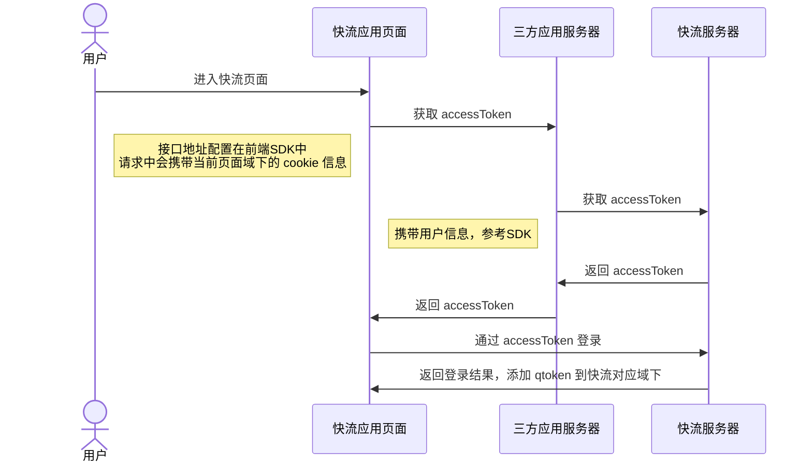

[上一页](quickstart.md)
[回目录](../README.md)
[下一页](flow.md)

# 概述
快流SSO登录是基于 OAuth 2.0 标准协议实现的，通过双向安全认证、免密登陆快流。

## 整体流程
### 三方应用对接
#### 对接前提
- 在对接快流引擎之前，首先你需要向快流科技申请 AppID 和 AppSecret，参考[快速开始](quickstart.md)。
- 对接应用的用户信息已同步至快流或者在快流中注册，目前支持飞书用户信息自动同步。

### 用户登录流程



## 后端
### 获取access_token
```java
public  String loginQFlow() {
	AuthenticationApi authenticationApi = new AuthenticationApiImpl();
	return authenticationApi.getAccessToken();
}
```

## 前端

```javascript

```

[上一页](quickstart.md)
[回目录](../README.md)
[下一页](flow.md)