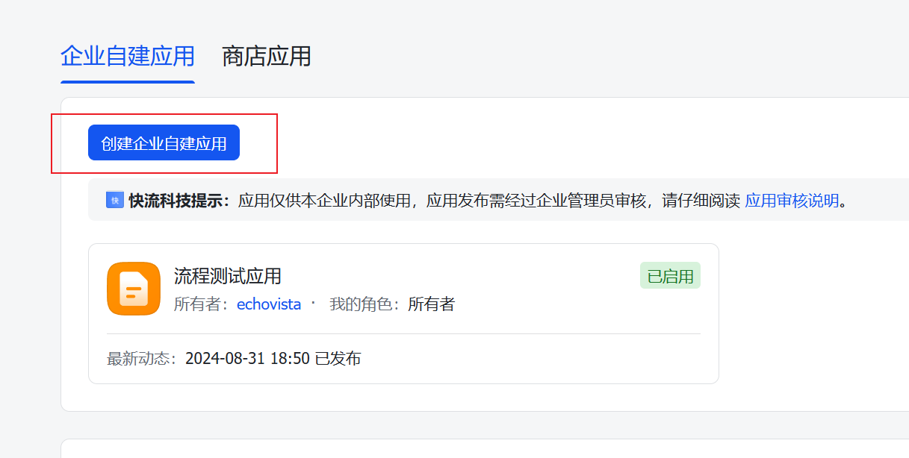
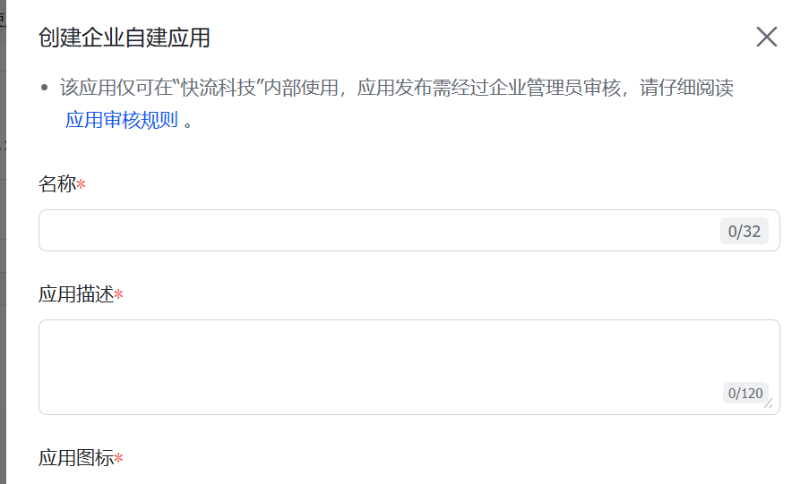
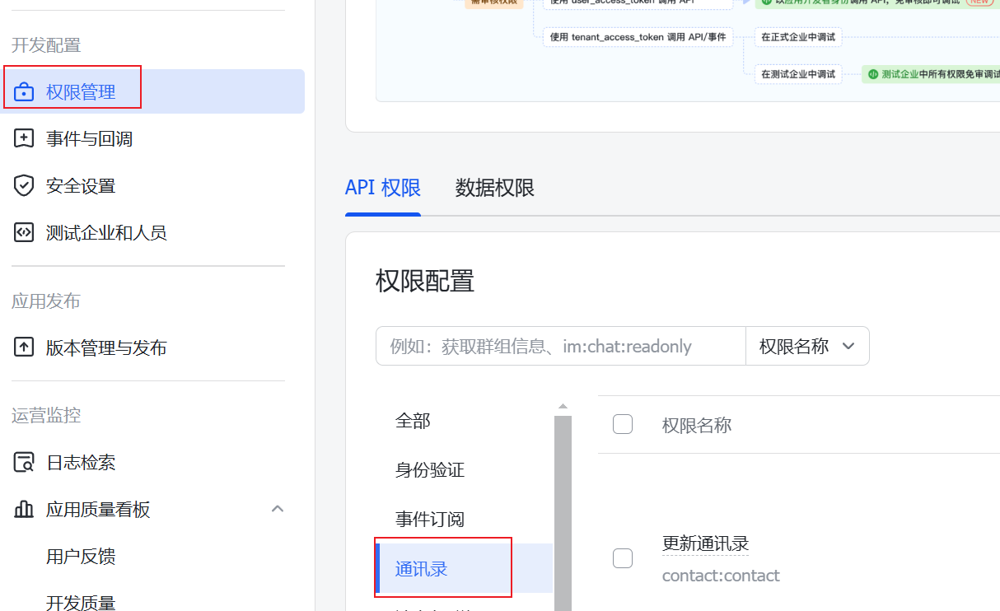
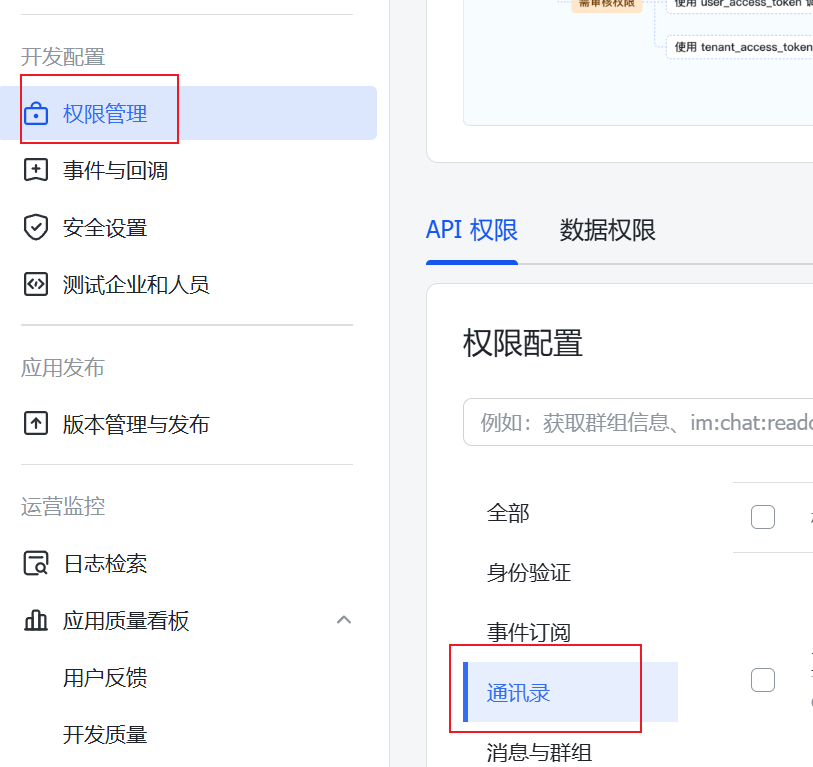
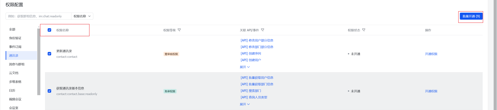
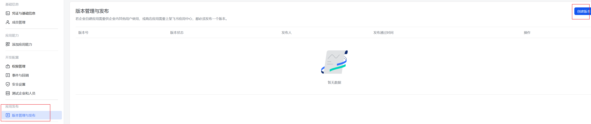
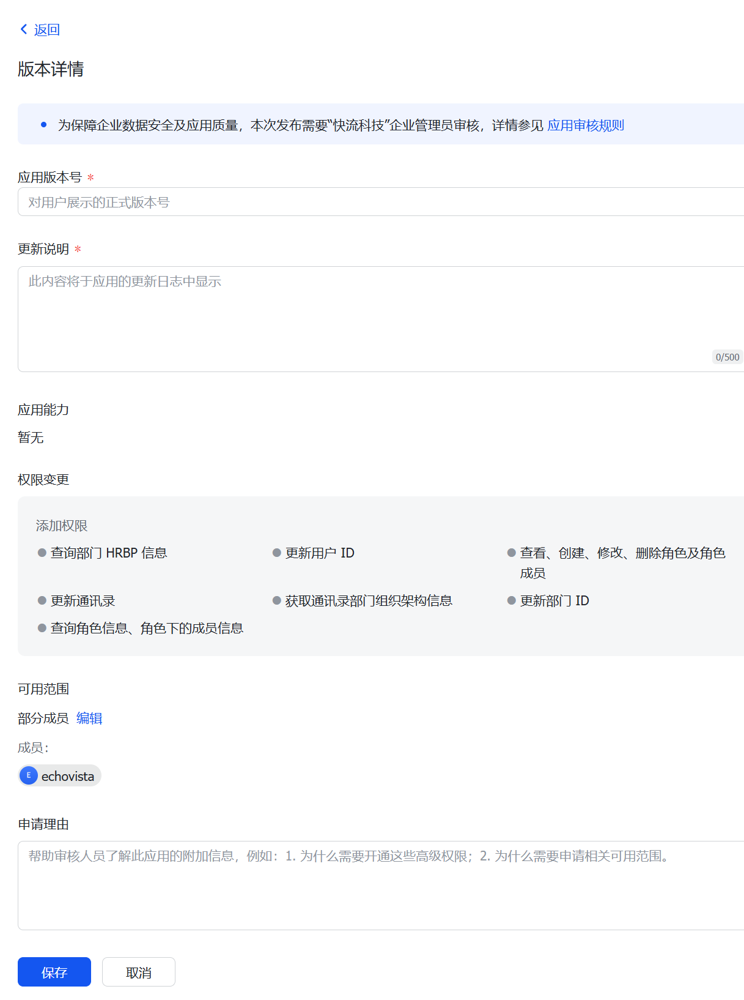

# 飞书应用对接
## 申请飞书应用
### 1. 创建应用
- 在 [开发者后台](https://open.feishu.cn/app)，根据实际需求，创建自建应用。
    
- 填写应用名称、描述等信息。
    

### 2. 获取 App ID 和 App Secret
- 点击 `凭证与基础信息` 获取 App ID 和 App Secret
    

### 3. 配置通讯录权限
> 如果需要同步用户与部门信息，需要开放通讯录授权。
- 点击 `权限管理`，选择 `通讯录`
    
- 勾选`所有权限`（或者所有查询权限），点击`批量开通`。
    
    
    

        
点击拆查看 同步部门、用户需要权限范围

        <ul>
            <li>获取通讯录基本信息</li>
            <li>获取部门基础信息</li>
            <li>获取通讯录部门组织架构信息</li>
            <li>获取用户基本信息</li>
            <li>获取用户组织架构信息</li>
            <li>获取成员所在部门路径</li>
            <li>查看成员的虚线上级 ID</li>
            <li>获取用户邮箱信息</li>
            <li>获取用户 user ID</li>
            <li>获取用户手机号</li>
            <li>通过手机号或邮箱获取用户 ID</li>
            <li>获取工作城市列表</li>
        </ul>

    

    > 注: 飞书的权限有多页，请务必确保开通上述所有权限

- 点击 `确认并前往创建应用版本` 发起应用变更审批。
    
- 创建版本
    
- 填写版本号等相关信息，发起审批；联系企业应用相关负责人，审批完成后，权限即可生效。
    
